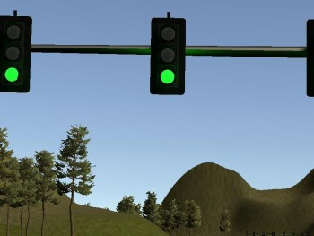
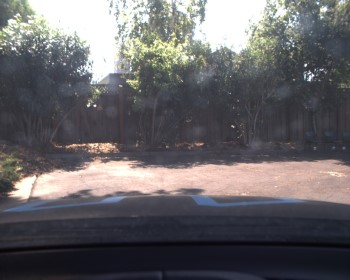
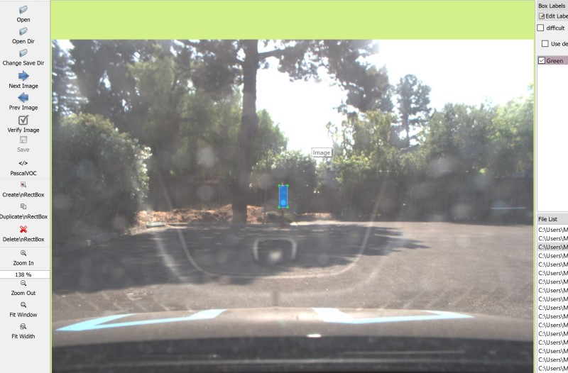

# Traffic Light Detection
[](http://www.udacity.com/drive)

Overview
---
The repository contains the instructions and links to the datasets for the pipeline used in training an *object detector* for traffic lights to be integrated into the final [Capstone project](https://github.com/aviralksingh/CarND-SuperAI-Capstone) of the Udacity Self Driving Car Nanodegree.

The project requires to detect traffic lights from the image send by the onboard camera and classify the detections into the 3 available categories: green, yellow and red so that the car can decide on how to behave in proximity of traffic lights.

One of the possible approaches would be to first run an object detector and then run a classifier, while a good solution this would require to train 2 different models and run them both in sequence. This may add overhead as the performance penalty to run the separate classifier, even though small might affect the driving behaviour.

The approach we took is instead to train an end-to-end model on an object detection pipeline, treating each traffic light state as a separate class, this approach comes from the the work done by [Bosch]((https://github.com/bosch-ros-pkg/bstld)) on their Small Traffic Light Dataset.

We use the [TensorFlow Object Detection API](https://github.com/tensorflow/models/blob/master/research/object_detection) in order to fine-tune the available models already trained on the [COCO Dataset](http://cocodataset.org/).

Dataset
---

TLDR; The final datasets used for training can be downloaded from [here](https://drive.google.com/open?id=1NXqHTnjVC1tPjAB5DajGc30uWk5VPy7C).

For this task we decided to perform transfer learning on some [well known models](https://github.com/tensorflow/models/blob/master/research/object_detection/g3doc/detection_model_zoo.md) using a relatively small dataset of mixed manually annotated and semi-automatically annotated images that were collected from the both the [Udacity Simulator](https://github.com/udacity/CarND-Capstone/releases) and the ros bags provided for training.

The dataset is composed of images coming from 4 source:

* **The udacity simulator**

    
    

* A **training bag** file with a video of traffic lights provided by Udacity as training ([Download](https://s3-us-west-1.amazonaws.com/udacity-selfdrivingcar/traffic_light_bag_file.zip))

    
    

* A **traffic lights bag** file file with a video of traffic lights only, recorded on the Carla testing site ([Download](https://drive.google.com/file/d/0B2_h37bMVw3iYkdJTlRSUlJIamM/view?usp=sharing))

    
    

* A **loop bag** file file with a video of a complete loop, recorded on the Carla testing site ([Download (Same as above)](https://drive.google.com/file/d/0B2_h37bMVw3iYkdJTlRSUlJIamM/view?usp=sharing))

    
    

The images manually annotated were labelled with [LabelImg](https://github.com/tzutalin/labelImg) while for the **semi-automatic annotation** a small [utility](./label_data.py) is included that runs one of the tensorflow pretrained models on a set of images capturing the bounding boxes and labelling them with a predefined label:

```sh
$ python label_data.py --data_dir=data/simulator/red --label=red --model_path=models/ssd_inception_v2_coco_2018_01_28/frozen_inference_graph.pb
```

Note that all the annotations in the dataset were manually verified and/or adjusted.



In order to train the model using the object detection API the images needs to be fed as a [TensorFlow Record](https://www.tensorflow.org/tutorials/load_data/tf-records), the repository contains a small [utility](./create_tf_record.py) (loosely based on the [TensorFlow object detection api](https://github.com/tensorflow/models/tree/master/research/object_detection) tool) that converts the annotated images into a [TensorFlow Record](https://www.tensorflow.org/tutorials/load_data/tf-records) optionally splitting the dataset into train and validation:

```sh
$ python create_tf_record.py --data_dir=data/simulator --labels_dir=data/simulator/labels --labels_map_path=config/labels_map.pbtxt --output_path=data/simulator/simulator.record
```

For more details about the conversion to TF Records see https://github.com/tensorflow/models/blob/master/research/object_detection/g3doc/using_your_own_dataset.md.


The final annotated dataset can be downloaded from [here](https://drive.google.com/open?id=1NXqHTnjVC1tPjAB5DajGc30uWk5VPy7C), it contains both the images and annotation and the final tensorflow record used for training and evaluation:

```
carla
    L carla_eval.record
    L carla_train.record
    L carla.zip
simulator
    L simulator_eval.record
    L simulator_train.record
    L simulator.zip
mixed_eval.record
mixed_train.record
```

The `mixed_eval.record` and `mixed_train.record` are the record files used for training the models; they contain images from the **simulator**, from the **training bag** provided by udacity and from the **traffic lights bag** on Carla site, they do not contain any image extracted from the *loop bag* recorded on the carla site as it is used for testing the models later on.

The carla.zip contains images for training and testing, the latter contains the images from the **loop bag** on the Carla site, while the former contains a mix of images from the **training bad** and the **traffic lights bag**.

#### Statistics

In the following the statistics of the dataset used (does not include images without traffic lights):

| Dataset        | Samples | Training | Evaluation |
|----------------|---------|----------|------------|
| Simulator      | 422     | 316      | 106        |
| Carla Training | 1411    | 1058     | 353        |
| Carla Testing  | 254     | N/A      | N/A        |
| **Sim + Carla**| **1833**| **1374** | **459**    |

Training
---

In order to train the model we use the [TensorFlow Object Detection API](https://github.com/tensorflow/models/blob/master/research/object_detection), which is not fully released and stable yet but it's usable with some workarounds.

#### Models

The models that we took into consideration come from the [model zoo](https://github.com/tensorflow/models/blob/master/research/object_detection/g3doc/detection_model_zoo.md) provided by tensorflow, in particular we chose models that are pre-trained on the [COCO Dataset](http://cocodataset.org/) since it contains the traffic light category which is useful for us in order to fine-tune the models, considering only those models that reports a balance between speed and accuracy:

| Model name  | Reported Speed (ms) | Reported COCO mAP[^1] | Template Config | Repo Config |
| ------------ | :--------------: | :--------------: | :--------------: | :--------------: |
| [ssd_mobilenet_v1_coco](http://download.tensorflow.org/models/object_detection/ssd_mobilenet_v1_coco_2018_01_28.tar.gz) | 30 | 21 | [Download](https://raw.githubusercontent.com/tensorflow/models/master/research/object_detection/samples/configs/ssd_mobilenet_v1_coco.config) | [Download](https://raw.githubusercontent.com/Az4z3l/CarND-Traffic-Light-Detection/master/config/ssd_mobilenet_v1.config)
| [ssd_inception_v2_coco](http://download.tensorflow.org/models/object_detection/ssd_inception_v2_coco_2018_01_28.tar.gz) | 42 | 24 | [Download](https://raw.githubusercontent.com/tensorflow/models/master/research/object_detection/samples/configs/ssd_inception_v2_coco.config) | [Download](https://raw.githubusercontent.com/Az4z3l/CarND-Traffic-Light-Detection/master/config/ssd_inception_v2.config)
| [ssdlite_mobilenet_v2_coco](http://download.tensorflow.org/models/object_detection/ssdlite_mobilenet_v2_coco_2018_05_09.tar.gz) | 27 | 22 | [Download](https://raw.githubusercontent.com/tensorflow/models/master/research/object_detection/samples/configs/ssdlite_mobilenet_v2_coco.config) | [Download](https://raw.githubusercontent.com/Az4z3l/CarND-Traffic-Light-Detection/master/config/ssdlite_mobilenet_v2.config)

#### Configuration Files

The repository contains various configuration files for the different datasets (mixed is the simulator + carla dataset) for different models, the things that I changed from the samples provided by tensorflow are:

* The various training and validation paths of the tf records (e.g. input_path elements)
* The **label_map_path**
* The **num_classes**
* The **num_steps**
* The **num_examples** in the evaluation section that correspond to the number of samples in the evaluation record
* The **ssd_anchor_generator** section, updating the scales and removing unused aspect ratios (the traffic lights are more or less 0.33)
* Reduced the number of detections from 100 to 10 in **max_detections_per_class** and **max_total_detections**

For example (taken from the ssd_inception_v2 config):

```json
model {
  ssd {
      num_classes: 3
      ...
      anchor_generator {
        ssd_anchor_generator {
            num_layers: 6
            min_scale: 0.1
            max_scale: 0.5
            aspect_ratios: 0.3333
            reduce_boxes_in_lowest_layer: true
        }
      }
      ...
  }
}

...

train_config: {
    ...
    fine_tune_checkpoint: "models/ssd_inception_v2_coco_2018_01_28/model.ckpt"
    from_detection_checkpoint: true
    num_steps: 20000
    ...
}

train_input_reader: {
  tf_record_input_reader {
    input_path: "data/mixed_train.record"
  }
  label_map_path: "config/labels_map.pbtxt"
}

eval_config: {
  num_examples: 459
  # Note: The below line limits the evaluation process to 10 evaluations.
  # Remove the below line to evaluate indefinitely.
  max_evals: 10
}

eval_input_reader: {
  tf_record_input_reader {
    input_path: "data/mixed_eval.record"
  }
  label_map_path: "config/labels_map.pbtxt"
  shuffle: false
  num_readers: 1
}
```

#### Locally

The models can be trained locally following the steps below (assuming tensorflow is installed already):

1. Download the trained models from the [TensorFlow Model Zoo](https://github.com/tensorflow/models/blob/master/research/object_detection/g3doc/detection_model_zoo.md) with their associated [pipeline configuration](https://github.com/tensorflow/models/tree/master/research/object_detection/samples/configs).

2. Download the [TensorFlow Object Detection API](https://github.com/tensorflow/models/blob/master/research/object_detection) and perform the required [installation steps](https://github.com/tensorflow/models/blob/master/research/object_detection/g3doc/installation.md):
   * ```git clone https://github.com/tensorflow/models.git```
   * Copy the ```research/object_detection``` and ```research/slim``` folders to the root folder
   * Get a copy of the [Protobuff Compiler](https://github.com/protocolbuffers/protobuf/) (e.g. For [Windows](https://github.com/protocolbuffers/protobuf/releases/download/v3.4.0/protoc-3.4.0-win32.zip))
   * Compile the protcol buffers: ```protoc.exe object_detection/protos/*.proto --python_out=.```
   * Set your PYTHONPATH: ```SET PYTHONPATH=%cd%;%cd%\slim``` (windows) or ```export PYTHONPATH=$PYTHONPATH:`pwd`:`pwd`/slim``` (linux) 
   * Test that the API is installed: ```python object_detection/builders/model_builder_test.py```

3. [Configure the pipeline](https://github.com/tensorflow/models/blob/master/research/object_detection/g3doc/configuring_jobs.md), copies of the configurations used can be found in the [config](./config) folder.

4. Install the [COCO Api](https://github.com/cocodataset/cocoapi) 
    
    * If you run into ["ImportError: No module named 'pycocotools'"](https://github.com/matterport/Mask_RCNN/issues/6) under windows:

        ```
        pip install Cython
        pip install git+https://github.com/philferriere/cocoapi.git#egg=pycocotools^&subdirectory=PythonAPI
        ```

    * If you run into ["TypeError: can't pickle dict_values objects"](https://github.com/tensorflow/models/issues/4780) look into object_detection/model_lib.py for ```category_index.values()``` and replace with ```list(category_index.values())```


5. [Run](https://github.com/tensorflow/models/blob/master/research/object_detection/g3doc/running_locally.md) the training session:

    ```
    python object_detection/model_main.py --pipeline_config_path=path/to/the/model/config --model_dir=path/to/the/output
    ```

6. Watch it happen with tensorboard:

        tensorboard --logdir=path/to/the/output


    And open the browser to `http://{machine_ip}:6006`

#### AWS

To train on AWS I used the Amazon Deep Learning AMI (v20 with tensorflow 1.12) and GPU graphics g3s.xlarge instance type (it has a more recent GPU and costs less than other GPU instances even though less ram), alternatively the GPU Compute p2.xlarge works fine (it's a tiny bit more expensive). I used spot instances with 5-6 hours request length (making sure to uncheck the delete volume option).

Once the instance is up and running we need to prepare the environment:

1. Connect to the instance:
   ```sh
   $ ssh ubuntu@instance-public-dns
   ```
2. Activate the tensorflow environment:
   ```sh
   $ source activate tensorflow_p36
   ```
3. Install the object detection API (E.g. From the linux [installation steps](https://github.com/tensorflow/models/blob/master/research/object_detection/g3doc/installation.md)):
   * Get the object detection API:
       ```sh
       git clone https://github.com/tensorflow/models.git tmp
       cp -r tmp/research/object_detection object_detection/
       cp -r tmp/research/slim slim/
       ```
   * Install dependencies:
        ```sh
        sudo apt-get install protobuf-compiler python-pil python-lxml python-tk
        pip install --user Cython
        pip install --user contextlib2
        pip install --user jupyter
        pip install --user matplotlib
        ```
    * Install the coco API:
        ```sh
        git clone https://github.com/cocodataset/cocoapi.git
        cd cocoapi/PythonAPI
        make
        cp -r pycocotools ../../pycocotools
        ``` 
    * Compile the proto buffers:
        ```sh
        protoc object_detection/protos/*.proto --python_out=.
        ``` 
    * Add the library to PYTHONPATH (Note: this expires with the session, put it in a script):
        ```sh
        export PYTHONPATH=$PYTHONPATH:`pwd`:`pwd`/slim
        ````
    * Test the installation:
        ```sh
        python object_detection/builders/model_builder_test.py
        ```
4. Download a model, for example SSD with Inception:
    ```sh
    mkdir models
    cd models
    wget http://download.tensorflow.org/models/object_detection/ssd_inception_v2_coco_2018_01_28.tar.gz
    tar -xzvf ssd_inception_v2_coco_2018_01_28.tar.gz
    cd ..
    ```
5. Download the dataset from https://drive.google.com/open?id=1NXqHTnjVC1tPjAB5DajGc30uWk5VPy7C and upload the record files to the `data` folder
6. Run the training:
    ```sh
    python object_detection/model_main.py --pipeline_config_path=config/ssd_inception_v2.config --model_dir=models/fine_tuned/ssd_inception
    ```
    
    If you want to run in it background:
    
    ```
    nohup python -u object_detection/model_main.py --pipeline_config_path=config/ssd_inception_v2.config --model_dir=models/fine_tuned/ssd_inception > training.log &
    ```
7. Run tensorboard:
   ```sh
   tensorboard --logdir=models/fine_tuned
   ```

   or in background:

   ```sh
   nohup tensorboard --logdir=models/fine_tuned > tensorboard.log &
   ```

NOTE: If you want to see some logging in the std out just add `tf.logging.set_verbosity(tf.logging.INFO)` after the imports in [./object_detection/model_main.py](./object_detection/model_main.py)

If your spot instance is stopped while training and you made sure to uncheck the "delete volume" option when requesting the spot instance, your volume will be retained and you can continue the training from a previous checkpoint:

1. Request a new instance
2. Go to the volumes and attach the previous volume to the new instance
3. Connect to the instance and mount the previous volume:

    ```sh
    mkdir /prev_volume
    sudo mount /dev/xvdf1 /prev_volume
    ```

    Note that the device name `xvdf1` can be found running `lsblk`.
4. Copy the old model to the new instance
   
   ```sh
    cp -r /prev_volume/home/ubuntu/models/fine_tuned /models/fine_tuned
    ```

5. Run the training with the same configuration (it will pick up the last checkpoint)

   ```sh
   python object_detection/model_main.py --pipeline_config_path=config/ssd_inception_v2.config --model_dir=models/fine_tuned/ssd_inception
   ```

#### Google Colab

Google provides the [Colab](https://colab.research.google.com) space to run interactive jupyter notebooks with GPU enabled VMs, it's an handy environment for experimenting, the repository contains a custom jupyter notebook that can be used to train the models using the tensorflow object detection API directly on Google Colab: [colab_training.ipynb](./notebooks/colab_training.ipynb).

Simply import the notebook in your colab space and change the `train_file_id` and `eval_file_id` to match the id of the `mixed_train.record` and `mixed_eval.record` in your google drive so that they can be downloaded in the colab workspace. In order to get the id of the files in google drive simply obtain a sharable link and copy the id from the link.

Export Model
---

In order to use the model for inference in production the graph must be freezed, the tensorflow object API comes with an handy utility to export the frozen model (See https://github.com/tensorflow/models/blob/master/research/object_detection/g3doc/exporting_models.md):

```sh
python object_detection/export_inference_graph.py --input_type image_tensor --pipeline_config_path config/ssd_inception_v2_coco.config --trained_checkpoint_prefix models/fine_tuned/ssd_inception/model.ckpt --output_directory models/fine_tuned/ssd_inception/exported
```

This will create a `frozen_inference_graph.pb` graph that can be loaded from tensorflow:

```python

import tensorflow as tf
import os

file_path = os.path.join('models', 'fine_tuned', 'ssd_inception', 'frozen_inference_graph.pb')
detection_graph = tf.Graph()

with detection_graph.as_default():
    od_graph_def = tf.GraphDef()
    with tf.gfile.GFile(file_path, 'rb') as fid:
        serialized_graph = fid.read()
        od_graph_def.ParseFromString(serialized_graph)
        tf.import_graph_def(od_graph_def, name='')

```

And later used in a session as follow:

```python
with detection_graph.as_default():
    image_tensor = graph.get_tensor_by_name('image_tensor:0')
    boxes_tensor = graph.get_tensor_by_name('detection_boxes:0')
    scores_tensor = graph.get_tensor_by_name('detection_scores:0')
    classes_tensor = graph.get_tensor_by_name('detection_classes:0')
    detections_tensor = graph.get_tensor_by_name('num_detections:0')

    ops = [detections_tensor, boxes_tensor, scores_tensor, classes_tensor]

    with tf.Session() as sess:
        num_detections, boxes, scores, classes = sess.run(ops, feed_dict={image_tensor: image})

```

Evaluation
---

For the evaluation of the model we are interested in the classification of the images rather than the accuracy of the predicted box,
a [jupyter notebook is included](./notebooks/evaluation.ipynb) that simply runs the trained models on the set of images and computes the accuracy (in terms of correctly classified/total). The evaluation includes also "background" images that do not contain any traffic light to test for false positives. The accuracy is measured on both images from the simulator and iamges from the test site:

| Model                     | Accuracy (Simulator) | Accuracy (Test Site) | Avg Time (GPU) | FPS (GPU) | Avg Time (CPU) | FPS (CPU) |
|---------------------------|----------------------|----------------------|----------------|-----------|----------------|-----------|
| ssd_mobilenet_v1          |                      |                      |                |           |                |           |
| ssd_inception_v2          |                      |                      |                |           |                |           |
| **ssd_inception_v2_sim*** |                      |                      |                |           |                |           |
| ssdlite_mobilenet_v2      |                      |                      |                |           |                |           |


\* Trained on simulator images only